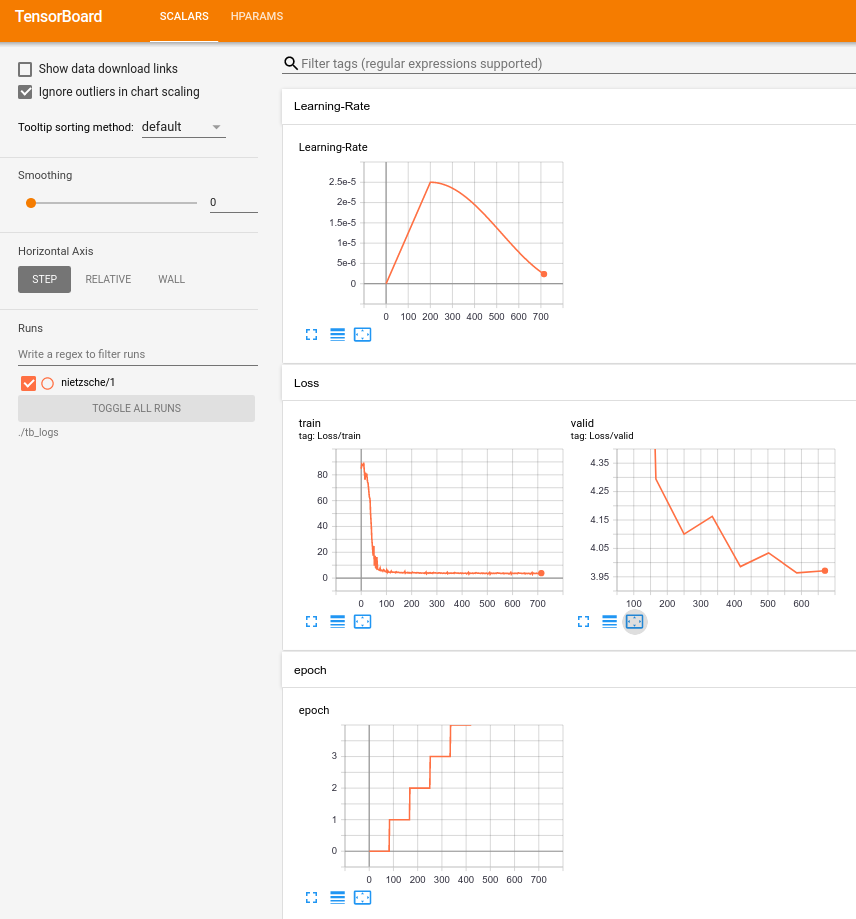
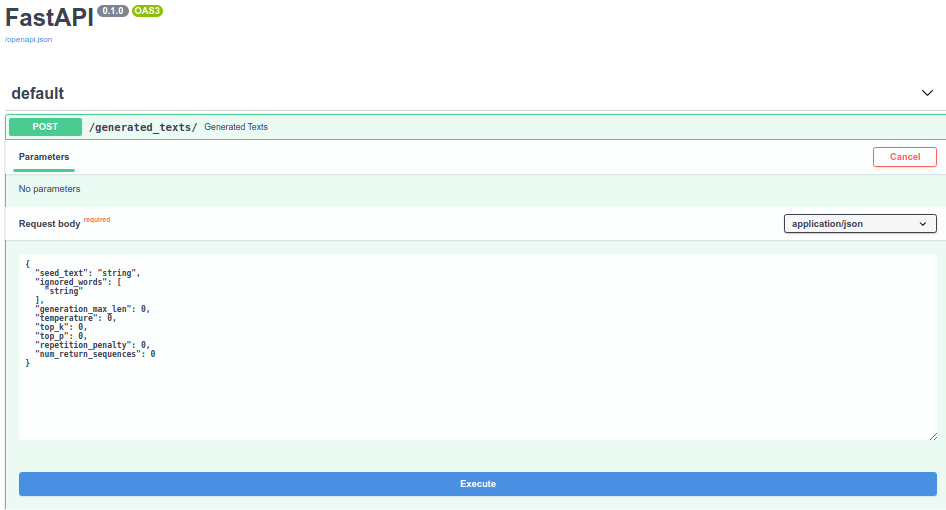
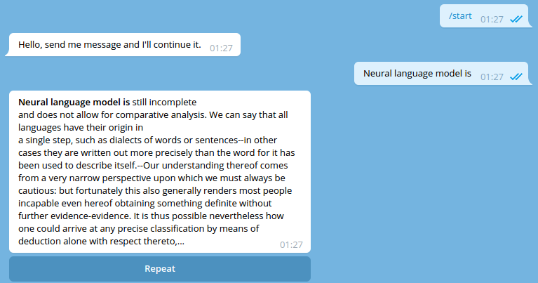

# Full Stack Transformer
Pytorch library for end-to-end transformer models training, inference and serving.
<br>
<br>
[Powered by](#powered-by) a list of great libraries.

## Library Design
The library is organized in such a way, that the [core](full_stack_transformer/core)
sub-package contains all modelling, data structures and data streaming classes.

In [tasks](full_stack_transformer/tasks) sub-package there are all tasks-specific code.

Available tasks:
- [Document Language Model](#document-language-model) - the classic document-base language
model training. It also provides application serving for interactive text generation.

## Document Language Model

*For now, there is only 1 task available in the library. So, I'll put an example of this
task usage right here in README. When another tasks will be implemented, I'll move
all examples in the documentation.*

### Features
- Automatic LM dataset preparation 
- End-to-end transformer LM training
- [Unlikelihood loss](https://arxiv.org/pdf/1908.04319.pdf) training
- Training LM with meta data (control codes, [CTRL](https://arxiv.org/pdf/1909.05858.pdf))
- Text generation tricks (top-k, [nucleus](http://arxiv.org/abs/1904.09751), repetition penalty, etc)
- Text generation as a service
- Telegram bot client

### Prepare dataset
First, you need two text files (train and validation) which contain raw documents.
For this example, files are already placed here:
```
data/documents/nietzsche/
├── train.documents
└── valid.documents
```
(If you want to start with your own files, check 
[Input Document Files Format](#input-document-files-format)

### Train Model
The library uses `pytorch-lightning` for training and arguments which are used by
lightning `Trainer` class are allowed as a command-line arguments for the script below.

To check them all (as well as task-specific args) execute:
```
python full_stack_transformer/tasks/document_lm/task_runner.py --help
```

Now, let's train the model:
```
python full_stack_transformer/tasks/document_lm/task_runner.py \
--experiments_root=./data/experiments/ \
--model_path=gpt2 \
--tokenizer_class_name=HFGPT2DocumentTokenizer \
--batch_size=4 \
--max_meta_len=0 \
--max_body_len=70 \
--ignore_meta_prob=1.0 \
--train_file=./data/documents/nietzsche/train.documents \
--valid_file=./data/documents/nietzsche/valid.documents \
--learning_rate=2.5e-05 \
--num_warmup_steps=10 \
--num_cycles=1 \
--gpus="0," \
--val_check_interval=1.0 \
--max_epochs=10 \
--unlikelihood_alpha=5.0 \
--accumulate_grad_batches=8 \
--experiment_name=nietzsche
```

If you don't have `gpt2` model downloaded, it'll be obtained from the huggingface server (548M).
Also, if you want to use a pre-trained gpt weights, which are stored locally, pass the path
to the model directory, like so: `--model_path path/to/local/gpt/model`.
Make sure, that you use an appropriate `--tokenizer_class_name` with your model. Check the
list of available tokenizers: [Available Tokenizers](#available-tokenizers).

The training has been started. All experiment related files a placed in the experiment directory:
```
data/experiments/nietzsche_v0/
├── description.json
├── generated.txt
├── logs
│   ├── debug.log
│   ├── errors.log
│   ├── info.log
│   └── nietzsche
│       └── version_0
│           ├── events.out.tfevents.1589375895
│           └── meta_tags.csv
└── models
    ├── epoch=5.ckpt
    └── epoch=6.ckpt
```

**WARNING!**

*In 0.2.0 version dynamic data generation is used. There are multiprocessing workers
that produce samples for training and there is no graceful shutdown for these workers now. 
It'll be fixed in next version, but for now please make sure, that all training processes are dead
when the training is finished. Or you can kill them manually:*
```
pkill -f nietzsche
```


### Monitor training
Run `tensorboard`:
```
tensorboard --logdir=./data/tb_logs/ --port=6006
```
TensorBoard interface is available here: [http://localhost:6006/](http://localhost:6006/)
<br>



Also, text samples are generated during the training on each validation step.
They are logged here:
```
cat data/experiments/nietzsche_v0/generated.txt
```
```
...
{
    {
    "Global step": 14,
    "Current epoch": 0,
    "Generator params": {
        "max_number_of_generated_tokens": 128,
        "num_return_sequences": 8,
        "repetition_penalty": 1.0,
        "temperature": 0.7,
        "top_k": 0,
        "top_p": 1.0
    },
    "Generated samples": [
        "The last, most important aspect of a good writer...
...
```


### Serve application

When the model is trained, it could be served for inference:
```
./full_stack_transformer/tasks/document_lm/serving/run.sh 9228 1 ./ ./data/experiments/nietzsche_v0/models/epoch\=6.ckpt cuda:0
```

Swagger is available here: [http://localhost:9228/docs](http://localhost:9228/docs)
<br>



### Serve telegram bot
If you want to play with the text generation via telegram bot, you need the service run
(previous step). Also, you need to obtain telegram api token. It could be easily done
via [@BotFather](https://t.me/botfather).

After you run the application server and got the api token, execute the following:
```
python full_stack_transformer/tasks/document_lm/telegram/app.py \
--telegram_api_token="API-TOKEN-OBTAINED-FROM-BOTFATHER" \
--text_generator_service_url=http://127.0.0.1:9228
```

That's it. Go find your bot in telegram and chat:



## Inference
After you train the model, you may want to perform inference in a code. Check an
example of [Language Generation](full_stack_transformer/tasks/document_decoder/examples/language_generation.py).


## Input Document Files Format
Raw input document files (train and valid) contains one document per line.
Each document is a dict (json-like) with `body` and `meta`(optional) fields.

For example:
```
{"body": "Article about animals", "meta": "Cats, dogs"}
{"body": "Article about movies"}
{"body": "Another article or document or whatever", "meta": "Some tags"}
...
```

## Available Tokenizers
For now, there are two tokenizers available for the `dialog_lm` task.

- `HFGPT2DocumentTokenizer` for huggingface models:
    - `gpt2`
    - `gpt2-medium`
    - `gpt2-large`
    - `gpt2-xl`
    - `distilgpt2`
    - maybe, there are some more models already. 
    Check [official huggingface repo](https://github.com/huggingface/transformers/blob/master/src/transformers/configuration_gpt2.py)
- `RuTransformersDocumentTokenizer`:
    - [ru_transformers](https://github.com/mgrankin/ru_transformers) medium size model

## Powered By
- [tokenizers](https://github.com/huggingface/tokenizers) fast tokenization and dataset preparation
- [transformers](https://github.com/huggingface/transformers) model backbones
- [pytorch-lightning](https://github.com/PyTorchLightning/pytorch-lightning) training process
- [fastapi](https://github.com/tiangolo/fastapi) application serving
- [aiogram](https://github.com/aiogram/aiogram) telegram bot serving

Also, I predominantly work with russian texts, so I actively used pre-trained gpt-model
and tokenizer (which I wrapped in the fast sentence piece tokenizer from 
[tokenizers](https://github.com/huggingface/tokenizers) library)
from the [ru_transformers](https://github.com/mgrankin/ru_transformers) repository.